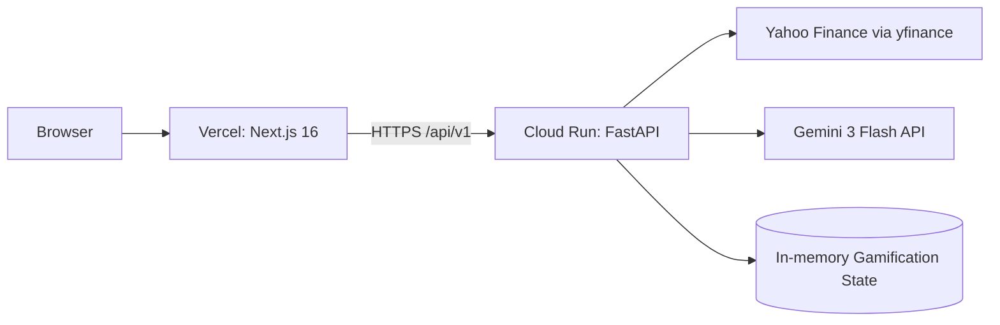
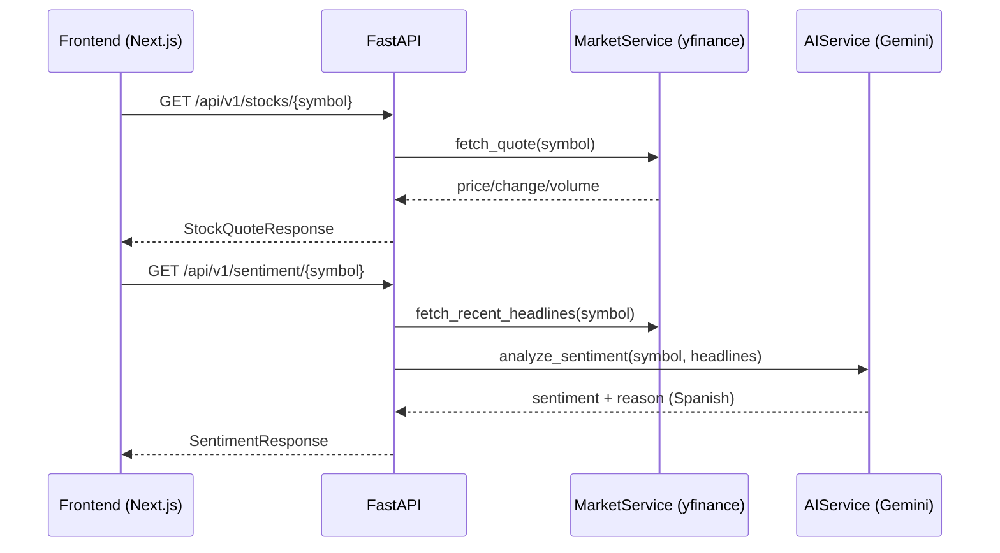
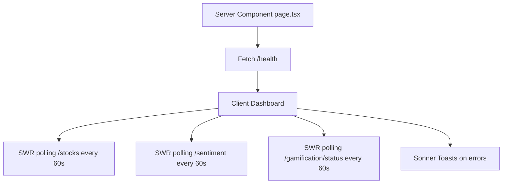

# Architecture Guide

## High-Level System Flow

## Runtime Boundaries

- Frontend and backend are independently deployable artifacts.
- Backend is the single integration point for market and AI providers.
- Frontend does not call external finance or AI providers directly.

## BFF Pattern (Backend for Frontend)

TraderPulse uses a BFF-style backend to:

1. Keep provider credentials (Gemini API key) server-side only.
2. Normalize response contracts for frontend simplicity.
3. Centralize provider-specific failures and map them to explicit HTTP status codes.
4. Enforce one CORS and security policy in a single control plane.

## Backend Request Lifecycle

## Frontend Rendering Flow

## Key Architectural Decisions (ADR)

### ADR-001: FastAPI for backend APIs

- **Decision**: Use FastAPI + Pydantic Settings.
- **Why**: Strong typing, excellent async ergonomics, first-class OpenAPI docs, and clean dependency injection patterns.
- **Consequence**: Requires Python ecosystem tooling (`pytest`, `ruff`) and environment-aware startup checks.

### ADR-002: SWR for client-side polling

- **Decision**: Use SWR for near real-time refresh (60s).
- **Why**: Stale-while-revalidate model keeps UI responsive while simplifying cache management.
- **Consequence**: Polling interval must be tuned for provider limits.

### ADR-003: Pydantic + Zod environment validation

- **Decision**: Validate env vars in both runtime boundaries.
- **Why**: Fail fast before runtime requests, reduce silent misconfiguration.
- **Consequence**: Invalid env values break startup/build by design.

### ADR-004: No fallback mock for market/AI failures

- **Decision**: Return explicit HTTP failures from backend when providers fail or symbols are missing.
- **Why**: Preserves trust and observability; avoids false confidence from fabricated outputs.
- **Consequence**: Frontend must handle errors gracefully (Sonner toasts).

### ADR-005: In-memory gamification for prototype phase

- **Decision**: Use mock/in-memory gamification state.
- **Why**: Meets feature requirements without introducing database complexity.
- **Consequence**: State resets on service restart and is non-persistent.

## Security Controls

- `GEMINI_API_KEY` is mandatory and injected via Secret Manager in production.
- CORS whitelist allows only `FRONTEND_URL` in production and localhost variants in development.
- External provider calls are isolated in service modules for centralized error handling.

## Deploy Topology

- Frontend: Vercel (primary) with Cloud Run fallback option.
- Backend: Cloud Run with Python 3.14-slim image.
- Secrets: Google Secret Manager mapped into Cloud Run env vars.
