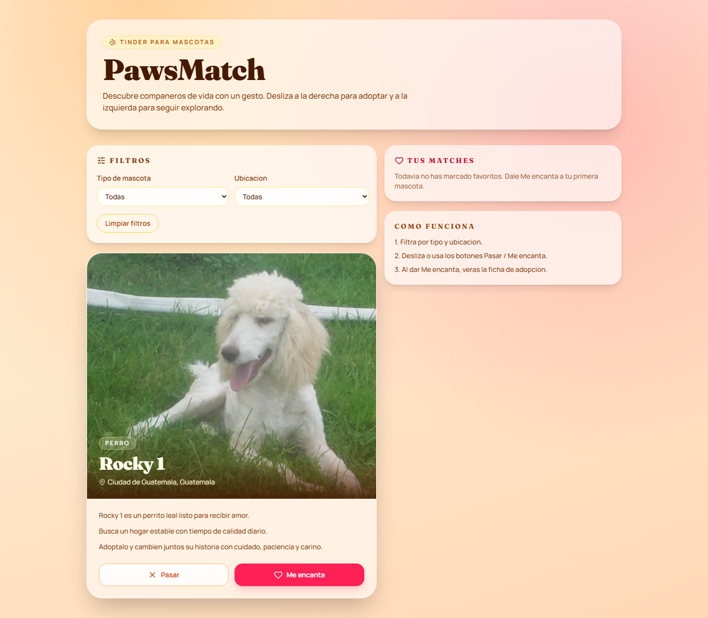

# App Showcase



<video controls src="assets/pawsmatch-demo.webm" width="960"></video>

Technical UI/UX summary:
- Mobile-first, glassmorphism-inspired interface with warm adoption-friendly palette.
- Swipe gestures and animated transitions powered by Framer Motion.
- Match flow with direct navigation to an adoption details screen.
- Spanish (es-GT) copy across user-facing screens.
- Filter system by pet type and location.

# PawsMatch

PawsMatch is a Tinder-style web app for pet adoption built with an AI-native workflow.
It includes:
- Pet catalog with images.
- Like/Pass match interactions.
- Filters by pet type and location.
- Adoption details screen with shelter contact and scheduling actions.

## Tech Stack

- Vite `8.0.x`
- React `19.2.x`
- TypeScript `6.0.x`
- Tailwind CSS `4.2.x` using `@tailwindcss/vite`
- React Router DOM `7.x`
- Framer Motion
- Lucide React
- Python + uv (`asset-generation`) with `google-genai`

## Architecture

```text
asset-generation/
  main.py
  pets.json
  .env.example

app/
  src/
    components/
    hooks/
    services/
    types/
    data/
    pages/
```

## Phase 1: Asset Generation (Preserved)

The dataset pipeline is implemented in `asset-generation/`:
- Model: `gemini-3-flash-preview`
- Output: `asset-generation/pets.json`
- Profiles: 50 dogs with `id`, `name`, and 3-line Spanish adoption bios
- Fallback mode: deterministic local generator when API key is missing/unavailable

### Run Asset Generation

```bash
cd asset-generation
uv sync
uv run main.py
```

Environment template:
- `asset-generation/.env.example`
- set `GEMINI_API_KEY` in `.env`

## Phase 2: Coding Standards Applied

Following the provided style examples:
- Types are explicit interfaces and type aliases in `app/src/types/pet.ts`.
- Service functions are async and throw meaningful errors in `app/src/services/petProvider.ts`.
- Custom hook pattern is used in `app/src/hooks/usePetDeck.ts`.

## Phase 3: Frontend Setup

The app in `app/` is initialized with Vite + React + TypeScript and Tailwind CSS (official Vite plugin flow).
A warm and friendly palette is defined in `app/src/index.css` and the main layout is centered, clean, and responsive.

## Phase 4: Dog API Analysis and Implementation

Source of truth used before implementation:
- Local data: `app/src/data/pets.json`
- Local types: `app/src/types/pet.ts`

Analysis result:
1. Random image endpoint response shape contains keys `message` and `status`.
2. The image URL path is `$.message`.
3. Local bio/name/id from `pets.json` is merged with external image URL from Dog API.
4. Merged interface in app code is represented by `Pet = PetProfile + { imageUrl, imageSource }`.
5. Error handling strategy:
   - network/status errors throw in `fetchRandomDogImage`.
   - malformed payload (missing `message`) throws.
   - any failure falls back to deterministic local image strategy.

Implemented in:
- `app/src/services/petProvider.ts`

## Phase 5: ToT Comparison (Card Stack)

Approach 1. Simple state (single current pet):
- Network usage: lowest initial usage, higher perceived latency between cards.
- UX fluidity: acceptable but can feel delayed on every swipe.

Approach 2. Pre-fetch stack (buffer of 3 upcoming pets):
- Network usage: moderate and predictable.
- UX fluidity: high, near-zero latency during swipes.
- Selected for this project as the best balance.

Approach 3. Virtualized list (many cards):
- Network usage: depends on fetch strategy; render overhead is efficient.
- UX fluidity: excellent for long feeds but adds complexity for Tinder-style single-card interaction.

## Phase 6: Modern Mobile-First UI Refactor

Implemented:
- Premium card experience in `app/src/components/PetCard.tsx`.
- Swipe animations and drag thresholds with Framer Motion.
- Modern iconography using Lucide.
- StrictMode-safe one-time initialization guards with `useRef` in `app/src/hooks/usePetDeck.ts`.
- Adoption details route in `app/src/pages/AdoptionDetailsPage.tsx` with:
  - shelter contact info
  - location and visiting hours
  - `Agendar visita`
  - `Seguir buscando`

## Phase 7: Build Error and Fix

Build was failing due a TypeScript merged declaration conflict:
- Component and imported type both named `PetFilters` in `app/src/components/PetFilters.tsx`.

Fix applied:
- Type import renamed to `PetFiltersState`.

Verification:
- `npm run build` completes successfully.

## Phase 8: Explicacion Tecnica (Espanol)

El flujo de conexion con The Dog API en `app/src/services/petProvider.ts` funciona asi:

1. Ciclo de vida del fetch:
- Cuando el hook necesita una nueva tarjeta de tipo `Perro`, llama a `fetchRandomDogImage()`.
- Esa funcion ejecuta `fetch('https://dog.ceo/api/breeds/image/random')`.
- Si la respuesta HTTP no es OK, lanza un error con el status.
- Si es OK, parsea JSON y valida su estructura.

2. Mapeo del JSON path hacia nuestra interfaz:
- The Dog API responde con `{ message: string, status: string }`.
- La URL de imagen esta en `message` (path `$.message`).
- `mapDogApiResponseToImageUrl` valida `status === 'success'` y que `message` no este vacio.
- Esa URL se asigna al campo `imageUrl` del objeto `Pet`.

3. Sincronizacion con bios locales:
- `pets.json` aporta `id`, `name`, `bio` (y el mock enrich agrega tipo/ubicacion/refugio).
- `mergePetProfileWithImage(profile)` combina esos datos locales con la imagen externa.
- Resultado final: un objeto `Pet` unificado listo para renderizar.
- Si falla la API o el payload, se mantiene la bio local y se usa imagen fallback.

## Phase 9: Run and Capture

Development server was launched and the app was accessed in browser tools.
Generated assets:
- `assets/pawsmatch-landing.png`
- `assets/pawsmatch-demo.webm`

## Local Development

```bash
cd app
npm install
npm run dev
```

Build:

```bash
npm run build
```

Optional showcase recapture:

```bash
npm run showcase
```

## GitHub Submission

I cannot push to your GitHub account directly from this environment, but the project is ready.
Use:

```bash
git add .
git commit -m "Build PawsMatch from scratch"
git remote add origin <your-repo-url>
git push -u origin main
```

Then submit your repository link for automatic grading.
