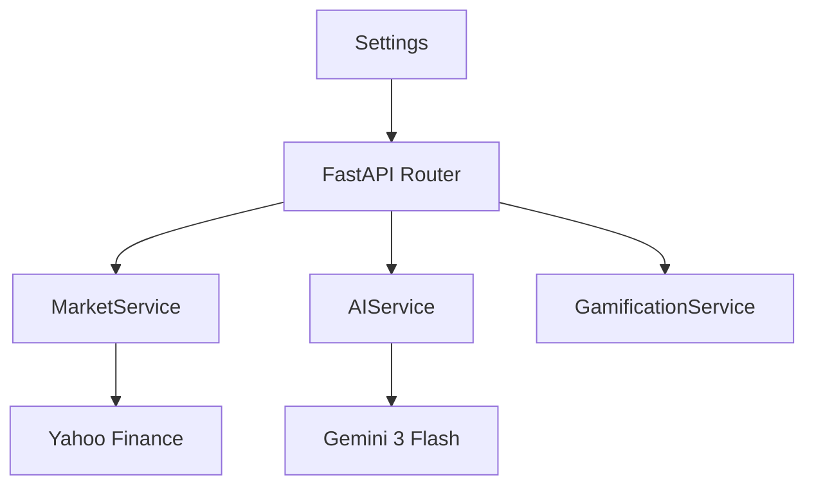
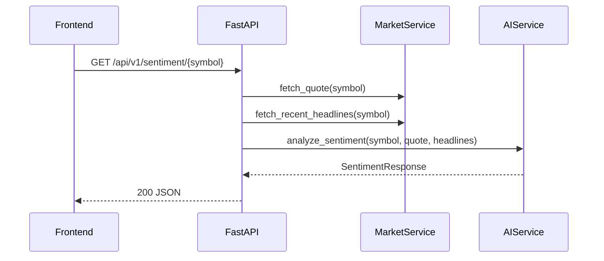

# Backend Architecture

## Component Diagram

## Request Flow

## Key Architectural Decisions (ADR)

### ADR-BE-001: Pydantic Settings as startup guardrail

- **Decision**: Validate all required environment variables on startup.
- **Why**: Surface deployment misconfiguration immediately.
- **Impact**: App fails fast instead of serving partially broken endpoints.

### ADR-BE-002: Service wrapper boundary around providers

- **Decision**: Integrate Yahoo Finance and Gemini only inside service modules.
- **Why**: Keep routes thin, testable, and provider-agnostic.
- **Impact**: Easier provider swap or multi-provider strategy later.

### ADR-BE-003: No mock fallback for market/AI failures

- **Decision**: Return explicit 404/502 errors when upstream fails.
- **Why**: Preserve data integrity and operational transparency.
- **Impact**: Frontend must handle degraded states with clear UX.

### ADR-BE-004: In-memory gamification for MVP

- **Decision**: Keep gamification state in memory only.
- **Why**: Minimize complexity for educational delivery.
- **Impact**: State resets after restart; suitable only for demo/prototype.

## Security

- CORS strict allowlist based on `FRONTEND_URL`.
- `GEMINI_API_KEY` required in settings and injected at runtime.
- Secrets stored in Google Secret Manager for Cloud Run deployment.
