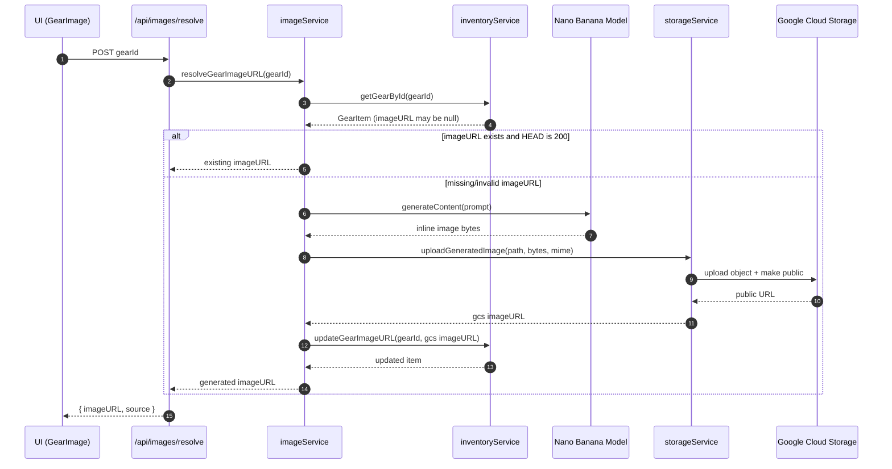
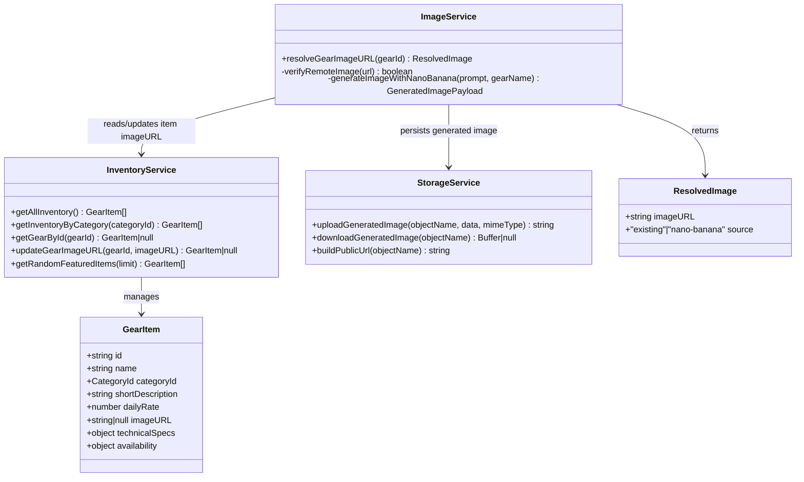

# Mermaid Diagrams

## 1) Image Resolution Flow (Sequence)

```mermaid
sequenceDiagram
    autonumber
    participant UI as UI (GearImage)
    participant API as /api/images/resolve
    participant ImageSvc as imageService
    participant InventorySvc as inventoryService
    participant NanoBanana as Nano Banana Model
    participant StorageSvc as storageService
    participant GCS as Google Cloud Storage

    UI->>API: POST gearId
    API->>ImageSvc: resolveGearImageURL(gearId)
    ImageSvc->>InventorySvc: getGearById(gearId)
    InventorySvc-->>ImageSvc: GearItem (imageURL may be null)

    alt imageURL exists and HEAD is 200
        ImageSvc-->>API: existing imageURL
    else missing/invalid imageURL
        ImageSvc->>NanoBanana: generateContent(prompt)
        NanoBanana-->>ImageSvc: inline image bytes
        ImageSvc->>StorageSvc: uploadGeneratedImage(path, bytes, mime)
        StorageSvc->>GCS: upload object + make public
        GCS-->>StorageSvc: public URL
        StorageSvc-->>ImageSvc: gcs imageURL
        ImageSvc->>InventorySvc: updateGearImageURL(gearId, gcs imageURL)
        InventorySvc-->>ImageSvc: updated item
        ImageSvc-->>API: generated imageURL
    end

    API-->>UI: { imageURL, source }
```

## 2) inventoryService + imageService (Class)

```mermaid
classDiagram
    class GearItem {
      +string id
      +string name
      +CategoryId categoryId
      +string shortDescription
      +number dailyRate
      +string|null imageURL
      +object technicalSpecs
      +object availability
    }

    class InventoryService {
      +getAllInventory() GearItem[]
      +getInventoryByCategory(categoryId) GearItem[]
      +getGearById(gearId) GearItem|null
      +updateGearImageURL(gearId, imageURL) GearItem|null
      +getRandomFeaturedItems(limit) GearItem[]
    }

    class ImageService {
      +resolveGearImageURL(gearId) ResolvedImage
      -verifyRemoteImage(url) boolean
      -generateImageWithNanoBanana(prompt, gearName) GeneratedImagePayload
    }

    class StorageService {
      +uploadGeneratedImage(objectName, data, mimeType) string
      +downloadGeneratedImage(objectName) Buffer|null
      +buildPublicUrl(objectName) string
    }

    class ResolvedImage {
      +string imageURL
      +"existing"|"nano-banana" source
    }

    InventoryService --> GearItem : manages
    ImageService --> InventoryService : reads/updates item imageURL
    ImageService --> StorageService : persists generated image
    ImageService --> ResolvedImage : returns
```
