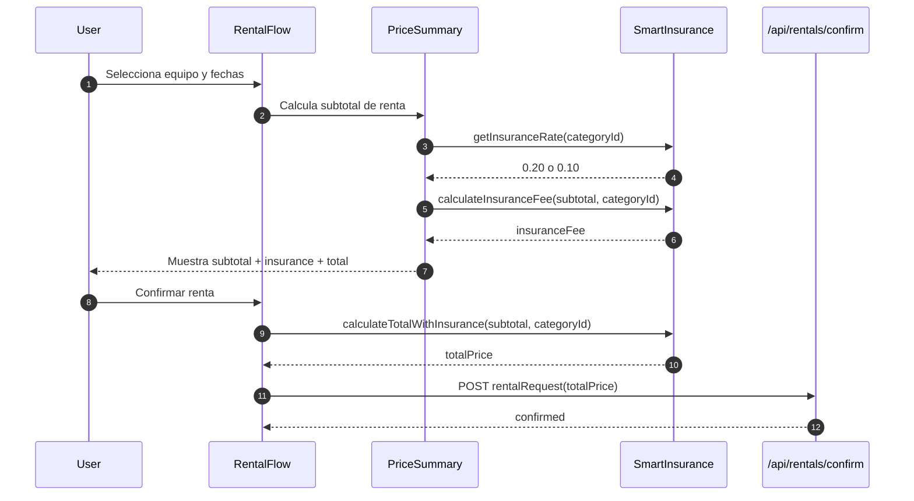
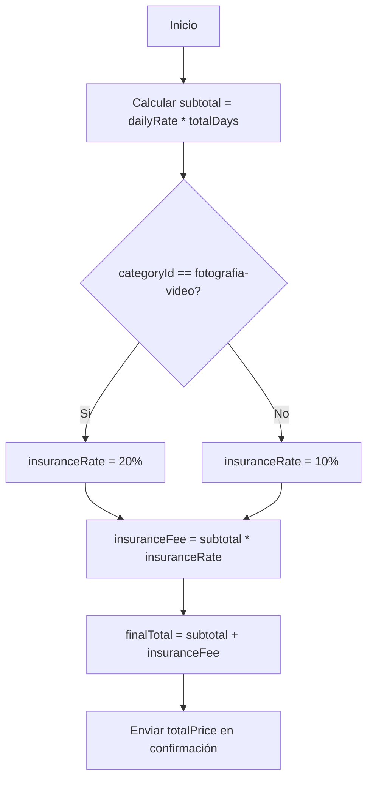

# Smart Insurance

## Business Rules

Smart Insurance is applied over the rental subtotal (`dailyRate * totalDays`) with category-based rates:

- Fotografía y Video: 20%
- Montaña y Camping: 10%
- Deportes Acuáticos: 10%

Final rental total formula:

`finalTotal = subtotal + (subtotal * insuranceRate)`

## Implementation Map

- Calculation module: `src/lib/smart-insurance.ts`
- UI summary integration: `src/components/features/RentalFlow/PriceSummary.tsx`
- Rental request integration: `src/components/features/RentalFlow/RentalFlow.tsx`

## Test Strategy

- Unit tests: `src/lib/smart-insurance.test.ts`
- Component rendering tests: `src/components/features/RentalFlow/PriceSummary.test.tsx`
- End-to-end flow assertions in integration: `src/components/features/RentalFlow/RentalFlow.integration.test.tsx`

## Mermaid: Sequence

## Mermaid: Calculation Flowchart

