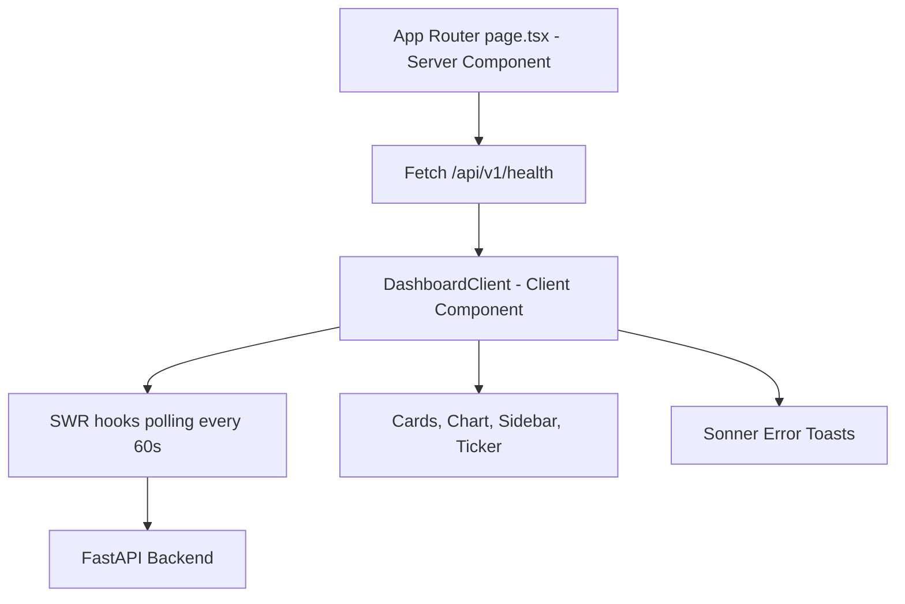

# Frontend Architecture

## Rendering Model

## Data Boundaries

- Server component provides initial health snapshot for first paint.
- Client components manage real-time updates and interactivity.
- All browser-side HTTP requests route through `src/lib/api.ts`.

## Key Architectural Decisions (ADR)

### ADR-FE-001: App Router with server-first page shell

- **Decision**: Use server component entrypoint for initial health status.
- **Why**: Faster first paint and explicit backend handshake.
- **Impact**: Requires robust error handling when backend is unavailable.

### ADR-FE-002: SWR polling strategy

- **Decision**: Poll quote/history/sentiment/gamification every 60s.
- **Why**: Balanced freshness vs. provider load and browser cost.
- **Impact**: Data can be up to 60s stale between intervals.

### ADR-FE-003: Sonner for user-facing API failures

- **Decision**: Show backend errors via toast notifications in Spanish.
- **Why**: Immediate feedback without breaking page structure.
- **Impact**: Error deduplication logic is needed to avoid toast spam.

### ADR-FE-004: Zod env validation at module load

- **Decision**: Validate `NEXT_PUBLIC_API_URL` before app runtime.
- **Why**: Fail fast on deployment misconfiguration.
- **Impact**: Invalid env blocks startup by design.

## Visual System

- Dark analytical canvas with gradient atmosphere.
- Display typography: `Space Grotesk`; technical metrics: `IBM Plex Mono`.
- Strong semantic color mapping:
  - Green: bullish/healthy states.
  - Red: bearish/failure states.
  - Zinc/cyan accents for neutral/system information.
